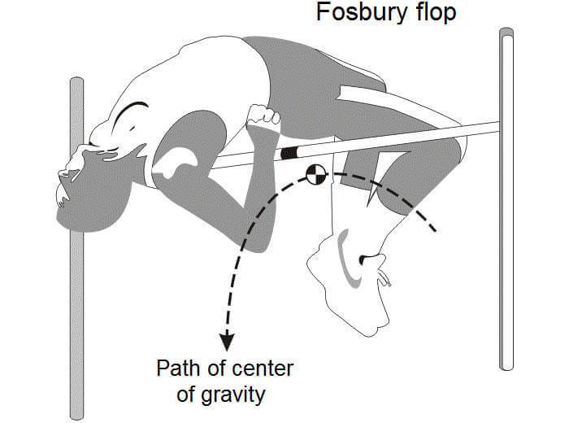

# Pulumi 初体验



---

## Pulumi 如何工作


---

## 初始化项目

确保你已经注册 pulumi 账号，本地安装了 pulumi 并且运行过 `pulumi login`。

```bash
$ pulumi new aws-typescript
```

---

## 项目文件一览

```bash
❯ tree -L 1
.
├── Pulumi.dev.yaml: pulumi stack 配置
├── Pulumi.yaml: pulumi 项目配置
├── index.ts： 项目入口
├── package.json
└── tsconfig.json
```

---

## 运行 pulumi

```bash
$ pulumi up
Previewing update (dev):
     Type                 Name           Plan
 +   pulumi:pulumi:Stack  demo-site-dev  create
 +   └─ aws:s3:Bucket     my-bucket      create

Resources:
    + 2 to create

Do you want to perform this update?  [Use arrows to move, enter to select, type to filter]
  yes
> no
  details

Do you want to perform this update? yes
Updating (dev):
     Type                 Name           Status
 +   pulumi:pulumi:Stack  demo-site-dev  created
 +   └─ aws:s3:Bucket     my-bucket      created

Outputs:
    bucketName: "my-bucket-127d4fc"

Resources:
    + 2 created
```

* 演示 pulumi 站点

---

## Demo 1: 静态网站

* 添加 s3 bucket
* 添加 website 支持
* 生成前端页面：`npx degit sveltejs/template app`
* 拷贝文件

---

## Demo 2: 用 API gateway 做静态网站，并提供 domain

* route 53
* aws certificate
* api gateway

---

## Demo 2: image-resize

* 创建 s3
* s3 onObjectCreated 事件
* `aws s3 cp ~/Downloads/luiz.jpg s3://(pulumi stack output bucketName)`

---

## 释放资源及删除项目

```bash
$ pulumi destroy
$ pulumi stack rm --force
```
